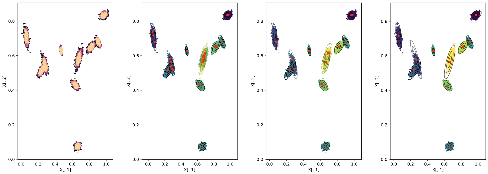

# Exemplar-GMM-with-L1-Regularization
An implementation of the method introduced in 'An Efficient Algorithm for Model-Based Clustering using Exemplar Means and L1 Regularization'. This library will be regularly updated with extensive experimental results for the methods introduced in the paper. 



We include a ZIP file of the real datasets used in the paper as .csvs. To generate the simluated data, the R library MixSim is used. To create the simulated data in the directory Data/Simulated, run the following in the command line:
```console
Rscript WriteMixSimData.R
```

To cluster using the EGMM library, the following libraries are required: Numpy, SciPy, Scikit-learn, MatPlotLib, Time. The results of the clusterings will be printed to EGMM_Assess.csv. To execute, run the following in the command line: 
```console
python3 EGMM_Assess.py
```

#### Future Updates
16/04 - Improved search for theta parameter. Improved reporting of results. Implementation of MixMod methods used in the paper. 
21/04 - Allowing users to specify thresholds from decision graph as in R's densityClust package. Subsampling for faster KDE. Large-scale real-world dataset implementations and results. 
